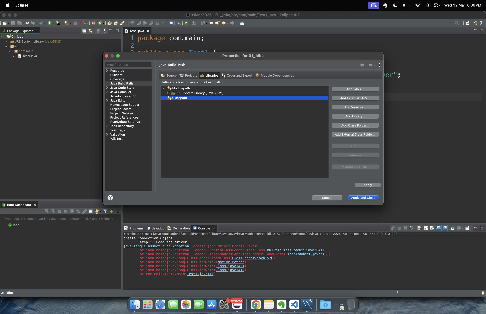
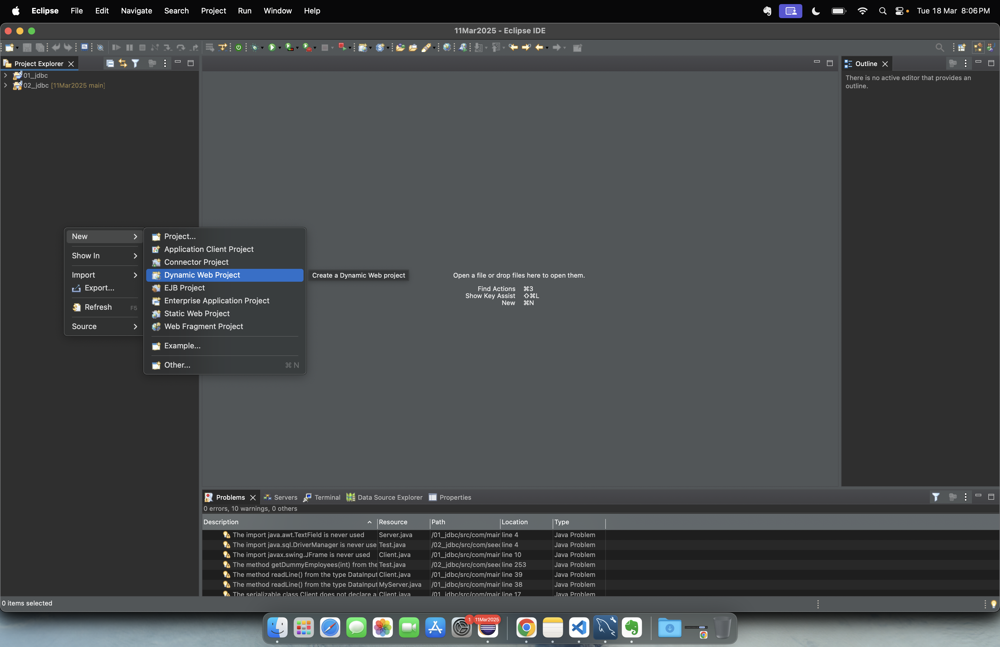

# Set Up
1. install oracle 
https://www.oicbasics.com/2020/01/download-oracle-database-11g-xe-express.html 11g

# JDBC
## jdbc type
1. JDBC-ODBC bridge
2. Native-API driver
3. Network-Protocol driver (Middleware driver)
4. Database-Protocol driver (Pure Java driver) or thin driver.

## sql 
```
DML:
  Select
  Insert
  Update
  Delete
  Merge

DDL:
  Create
  Alter
  Rename
  Truncate
  Drop


TCL:
 Commit
 Rollback
 Save
  

DCL:
 Grant
 Revoke

```

### create connection object
1. step 1: Load the driver
```
oracle:
download jar file: ojdbc8.jar
https://www.oracle.com/pk/database/technologies/appdev/jdbc-downloads.html

mysql:
https://dbschema.com/jdbc-driver/mysql.html?srsltid=AfmBOoogp05X9fTHxZ5TgTWYmhdRwufkUAPapt3QI_gClbdZSsrG1FwW

right click to the project -> build path -> configure build path
click on library tab , then click on classpath


```



## JDBC object
1. connection

2. Statement 
3. PreparedStatment
4. CallableStatement: stored procedure and function

### method
executeUpdate  => insert, update, delete, merge
executeQuery => select
execute => all type of query


## Transaction
```
Emp1             Emp2
10000           3000
sql:
update -2000 where id=1
update + 2000 where id= 2


insert log
commit;
which follow ACID 
A
C 
I   
D
```


## WCD (web componenet devlopment)
```
In core java Distributed architechture can be acheived using Socket programming.

Client                      Server

request
response
```

### HTTP (Hypter Text transfer protocol)


client  --------Request---------->   Serve + R
        <-------- Response --------

#### HTTP request
method/ Http version
host:
user-agent:
accept:
content-type
content-length

body?
```
request => reqeust header + request represention + body(optional)
POST / HTTP/1.1
HOST: www.gmail.com/signin
user-agent: 
accept: */*

Content-Type : application/json
Content-Legth: 200

{
  "name" : "Jack",
  "salary" : 5000
}
```

#### HTTP response
http version/status code
date:
contentType:

<html>


```
HTTP/1.1 201 Created
Content-type: 
location: 


{
  "id" : 1,
  "name" : "Jack",
  "salary" : 5000
}
```

#### status code
1XX -> informational
  100 continue

2XX -> sucess
   200 OK
   201 created
   204 no content

3XX -> redirect
   301 Moved permanently

4XX -> error from the client side
  400: bad request
  401: unauthorized
  403: forbidden
  404: page not found


5XX  -> error from the server 
 500 Internal server error
 502 bad gateway
 503 service unavailable
 504 gateway timeout

#### type of request
1. get
2. post


3. put
4. delete


## WCD
apache Tomcat
unzip the folder and keep in c drive

## set the env system variable
JAVA_HOME
CATALINA_HOME

### create dynmaic project


request: localhost:8080/<context-name>/welcome.html
response: 
<!DOCTYPE html>
<html>
<head>
<meta charset="UTF-8">
<title>Welcome</title>
</head>
<body>
</body>
</html>


#### life cycle of servlet
0. instanciation  depend upon load on startup , default value =-1
     when first request made
1. init
2. service  doGet/doPost
3. destroy


#### init-param and context-param

#### set attribute and get attribute
1. context(application)
2. session
3. request

#### servlet collabaration

 A  --->   Seed infotech   Adv Java  


#### why to use session object


